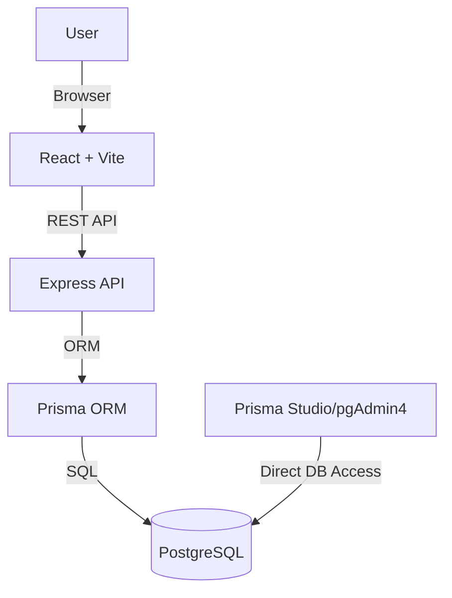

# Barter Community Nexus

A modern web application for community-driven bartering, built as a DBMS/SQL project for engineering coursework. This app enables users to list, offer, and trade goods, with a secure admin dashboard for management.

---

## 🚀 Features
- User registration and login (case-insensitive, secure)
- Admin login and dashboard (manage users, items, trades)
- Real-time updates via WebSockets
- Item listing, offers, and trade management
- Activity logging
- PostgreSQL database (Prisma ORM)
- Modern React frontend (Vite)

---

## 🛠️ Setup Instructions

### 1. **Clone the Repository**
```sh
git clone <your-repo-url>
cd barter-community-nexus
```

### 2. **Backend Setup**
```sh
cd barter-backend
npm install
```
- Copy `.env.example` to `.env` and set your Postgres connection string:
  ```env
  DATABASE_URL=postgresql://<user>:<password>@localhost:5432/<dbname>?schema=public
  ```

### 3. **Frontend Setup**
```sh
cd ../
npm install
```
- Configure your API endpoint in `.env` (if needed):
  ```env
  VITE_API_URL=http://localhost:15000
  ```

### 4. **Database (Postgres) Setup**
- Make sure PostgreSQL is running.
- Run Prisma migrations:
  ```sh
  cd barter-backend
  npx prisma migrate dev --name init
  ```
- (Optional) Open Prisma Studio to view/manage data:
  ```sh
  npx prisma studio
  ```

### 5. **Seed Data**
- (If you have a `prisma/seed.ts` or SQL seed, run it. Otherwise, add users/admins via Prisma Studio or SQL.)

---

## 🏁 Running the App

### Start Backend:
```sh
cd barter-backend
npm run dev
# or
npx ts-node src/app.ts
```

### Start Frontend:
```sh
cd ../
npm run dev
```

---

## 👤 Demo Credentials (for testing)

> **Default Admin:**  
> Email: `wingspawn28@gmail.com`  
> Username: `wingspawn`  
> Password: `wingspawn`

> **Default User:**  
> (Add via registration or Prisma Studio)

---

## 📄 Notes
- Make sure `.env` files are not committed (see `.gitignore`).
- Passwords are stored in plaintext for demo; use hashing for production!
- For deployment, update all URLs and environment variables accordingly.

---

## 📚 License
MIT (or specify your university’s requirement)

## Scripts
- `npm run dev` – Start frontend in development mode
- `npm run start` – Start backend server
- `npm run build` – Build frontend for production
- `npm test` – Run tests
- `npx prisma studio` – Open Prisma Studio

## Database Migrations
- To create a new migration:
  ```sh
  npx prisma migrate dev --name <migration-name>
  ```
- To revert a migration:
  ```sh
  npx prisma migrate resolve --rolled-back <migration-name>
  ```

## Real-Time Sync: Prisma, pgAdmin4, and the App

### Data Changes
- Any data updates (create, update, delete) made via the app, Prisma Studio, or directly in pgAdmin4 are immediately reflected everywhere, as long as the app fetches fresh data from the database.
- For true real-time updates in the frontend, the app uses WebSockets to broadcast changes as they happen. (See below for setup.)

### Schema Changes
- If you change the schema using Prisma (edit `schema.prisma` + migrate), changes are instantly available in pgAdmin4 and the app.
- If you change the schema directly in pgAdmin4 (or via raw SQL), you must update Prisma:
  ```sh
  npm run db:pull   # Pull latest DB schema into Prisma
  npm run db:gen    # Regenerate Prisma client
  ```
- Always regenerate the Prisma client after any schema change.

### NPM Scripts for Sync
- `npm run db:pull` – Pulls DB schema changes into Prisma (`prisma db pull`)
- `npm run db:gen` – Regenerates Prisma client (`prisma generate`)

### Real-Time Data Sync in the App
- The backend uses WebSockets to push updates to the frontend when data changes.
- To enable this, start the backend and frontend as usual. The frontend will receive live updates for item/user/trade changes.

---
- To create a new migration:
  ```sh
  npx prisma migrate dev --name <migration-name>
  ```
- To revert a migration:
  ```sh
  npx prisma migrate resolve --rolled-back <migration-name>
  ```

## Testing
- All tests are in `barter-backend/tests`.
- Run tests with:
  ```sh
  npm test
  ```

## API Overview
See `API.md` for a list of available endpoints, methods, and request/response formats.

## Architecture Diagram




## Project info


## How can I edit this code?

There are several ways of editing your application.


Clone this repository and follow the local setup instructions below to start developing and contributing.

Changes made locally should be committed and pushed to your remote repository as usual.

**Use your preferred IDE**

# Community Barter System

A full-stack application for managing a barter-based community marketplace. Includes real-time sync, robust admin tools, and analytics.

---

## 🏁 Quick Start

For detailed setup and usage instructions, see [HOW_TO_RUN_AND_USE.md](./HOW_TO_RUN_AND_USE.md).

### TL;DR
```sh
git clone <YOUR_GIT_URL>
cd <YOUR_PROJECT_NAME>
npm install
cd barter-backend
npm install
cp .env.example .env
# Edit .env with your DB credentials
npx prisma migrate dev --name init
npm run start
# In another terminal:
cd ../
npm run dev
```

---

## 🛠️ Tech Stack
- **Frontend:** React, Vite, TypeScript, Tailwind CSS
- **Backend:** Node.js, Express, TypeScript
- **Database:** PostgreSQL
- **ORM:** Prisma
- **Testing:** Jest, Supertest
- **Dev Tools:** Prisma Studio, pgAdmin4

---

## 📂 Project Structure
```
barter-community-nexus/
├── barter-backend/      # Express API, Prisma, DB logic
├── src/                # Frontend React code
├── public/             # Static assets
├── docs/               # Documentation
├── .env.example        # Sample environment variables
└── ...
```

---

## 🚀 Features
- User, Item, Offer, Trade, and Rating management
- Real-time dashboard with WebSocket sync
- Admin analytics, activity log, and SQL query tool
- Secure authentication and environment variable management
- Database admin via Prisma Studio and pgAdmin4

---

## 📦 Dependency Management
- Regularly check for outdated packages:
  ```sh
  npm outdated
  ```
- Update all safe dependencies:
  ```sh
  npm update
  ```
- For major version upgrades, check changelogs and run:
  ```sh
  npm install <package>@latest
  ```

### Security Checks
- Regularly audit for vulnerabilities:
  ```sh
  npm audit
  ```
- Apply available fixes:
  ```sh
  npm audit fix
  ```
- For forceful fixes (may introduce breaking changes):
  ```sh
  npm audit fix --force
  ```

### Cleaning Up
- Remove unused dependencies:
  ```sh
  npm prune
  ```
- Clean install (if you notice issues):
  ```sh
  rm -rf node_modules package-lock.json # (use File Explorer or PowerShell on Windows)
  npm install
  ```

### General Best Practices
- Pin or review versions in `package.json` as needed.
- Use TypeScript for type safety.
- Keep your `.env` file up to date and **never commit secrets**.
- Document your update process for future contributors.
- Use version control (git) and commit regularly.

### After Any Update
- Run your app and tests to ensure nothing is broken:
  ```sh
  npm run dev
  npm run build
  # ...and your test scripts
  ```
- Check for new warnings or errors in the terminal and browser.

---

_Keeping dependencies updated and following these practices will help ensure your project stays stable, secure, and easy to work with for years to come!_

---

## 🗄️ Backend, Database & Prisma Best Practices

Follow these guidelines to keep your backend and database healthy, reliable, and maintainable:

### Environment Variables & Security
- Store secrets (like `DATABASE_URL`) in your `.env` file. **Never commit secrets to version control!**
- Use environment variables for all credentials and sensitive config.
- Rotate database credentials regularly and after any suspected leak.

### Prisma ORM
- After editing your Prisma schema:
  ```sh
  npx prisma generate
  # If you changed the schema (models/tables):
  npx prisma migrate dev --name <migration-name>
  ```
- Use `npx prisma studio` to visually inspect and edit your data.
- Keep your `prisma/schema.prisma` file in sync with your actual database structure.
- Review [Prisma best practices](https://www.prisma.io/docs/concepts/components/prisma-best-practices).

### Database Management
- Use a tool like pgAdmin or Prisma Studio for safe database inspection and edits.
- Always back up your database before running destructive migrations or bulk updates.
- Use migrations (not manual SQL) to change your schema so everything is tracked and reproducible.
- Version control your migration files (`prisma/migrations`).

### Backend Code
- Use TypeScript for type safety and fewer runtime errors.
- Validate all user input on the backend (e.g., with Zod or Joi).
- Handle errors gracefully and log them for debugging.
- Write automated tests for key endpoints (see `barter-backend/tests`).

### Keeping Up-to-Date
- Regularly update Prisma and database drivers:
  ```sh
  npm update @prisma/client prisma
  ```
- Check for breaking changes in Prisma’s release notes before major upgrades.

### After Any Backend/DB Update
- Run all tests:
  ```sh
  npm test
  # or your test command
  ```
- Start your backend and check logs for errors.
- Verify that data changes in pgAdmin/Prisma Studio are reflected in your app and vice versa.

---

_Following these backend and database best practices will keep your app robust, secure, and easy to evolve!_

- Click the "Edit" button (pencil icon) at the top right of the file view.
- Make your changes and commit the changes.

**Use GitHub Codespaces**

- Navigate to the main page of your repository.
- Click on the "Code" button (green button) near the top right.
- Select the "Codespaces" tab.
- Click on "New codespace" to launch a new Codespace environment.
- Edit files directly within the Codespace and commit and push your changes once you're done.

## What technologies are used for this project?

This project is built with:

- Vite
- TypeScript
- React
- shadcn-ui
- Tailwind CSS

## How can I deploy this project?

To publish or share your project, use your preferred platform or deployment method (see deployment instructions below).

## Custom Domains

Yes it is!

To connect a domain, navigate to Project > Settings > Domains and click Connect Domain.

Refer to your deployment provider's documentation for instructions on connecting a custom domain.
