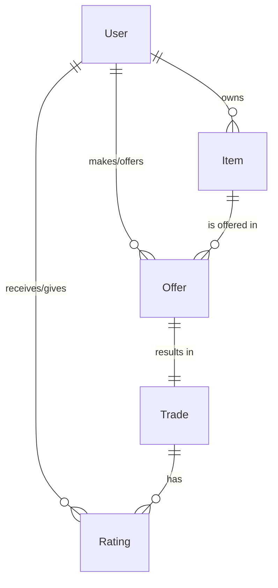
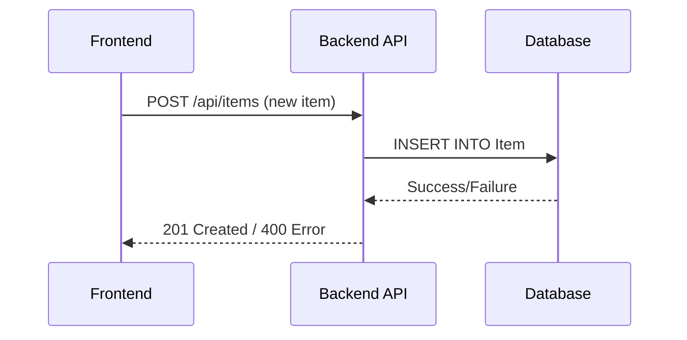

# Barter Community Nexus Backend

_Last updated: 2025-04-19_

---

## Entity-Relationship (ER) Diagram

Below is a simplified ER diagram for the main entities in the Barter Community Nexus system:


- **User**: Registers, owns items, makes offers, and can give/receive ratings.
- **Item**: Belongs to a user, can be offered in offers.
- **Offer**: Made by a user, references two items (offered/requested), can result in a trade.
- **Trade**: Created when an offer is accepted, can be rated.
- **Rating**: Given by one user to another for a trade.

---


---

## Project Overview
Barter Community Nexus is a robust backend for a modern barter marketplace, built with Node.js, Express, TypeScript, and PostgreSQL (via Prisma ORM). It supports user management, item listings, offers, trades, ratings, and real-time updates.

---

## Table of Contents
1. [Features](#features)
2. [Setup & Installation](#setup--installation)
3. [Database & Migrations](#database--migrations)
4. [API Reference](#api-reference)
5. [Testing](#testing)
6. [Real-Time & Advanced Features](#real-time--advanced-features)
7. [Developer Guide](#developer-guide)
8. [FAQ](#faq)

---

## 1. Features
- **JWT Authentication** for secure login and admin endpoints
- **CRUD** for users, items, offers, trades, and ratings
- **Bulk operations** (update/delete) for items/offers
- **Admin login** and role-based permissions
- **Real-time sync** using WebSocket and PostgreSQL triggers
- **Request profiling** for performance monitoring
- **Full test coverage** (Jest/Supertest)

---

## Sample API Documentation

### Create User
```
POST /api/users
Content-Type: application/json
{
  "username": "alice",
  "email": "alice@example.com",
  "password": "SecurePass123"
}
```
**Response:**
```
201 Created
{
  "id": 1,
  "username": "alice",
  "email": "alice@example.com"
}
```

### Create Item
```
POST /api/items
Content-Type: application/json
{
  "name": "Book",
  "description": "A great novel",
  "category": "Books",
  "condition": "Good",
  "userId": 1
}
```
**Response:**
```
201 Created
{
  "id": 1,
  "name": "Book",
  "description": "A great novel",
  ...
}
```

### List Items
```
GET /api/items
```
**Response:**
```
200 OK
[
  { "id": 1, "name": "Book", ... },
  ...
]
```

### Create Offer
```
POST /api/offers
Content-Type: application/json
{
  "fromUserId": 1,
  "toUserId": 2,
  "itemOfferedId": 1,
  "itemRequestedId": 2,
  "status": "pending"
}
```
**Response:**
```
201 Created
{
  "id": 1,
  "fromUserId": 1,
  "toUserId": 2,
  ...
}
```

### Accept Offer (Create Trade)
```
POST /api/trades
Content-Type: application/json
{
  "offerId": 1,
  "notes": "Let's trade!"
}
```
**Response:**
```
201 Created
{
  "id": 1,
  "offerId": 1,
  ...
}
```

### Create Rating
```
POST /api/ratings
Content-Type: application/json
{
  "userId": 2,
  "raterId": 1,
  "tradeId": 1,
  "ratingValue": 5,
  "comment": "Great trade!"
}
```
**Response:**
```
201 Created
{
  "id": 1,
  "userId": 2,
  "raterId": 1,
  ...
}
```

### User Login (JWT Auth)
```
POST /api/login
Content-Type: application/json
{
  "username": "alice",
  "password": "SecurePass123"
}
```
**Response:**
```
200 OK
{
  "user": { ... },
  "token": "<JWT_TOKEN>"
}
```

### Example Error Response
```
400 Bad Request
{
  "error": "Item creation failed",
  "details": "Missing required field: name"
}
```

### Authentication Notes
- Most endpoints require a valid JWT token in the `Authorization` header:
  ```
  Authorization: Bearer <JWT_TOKEN>
  ```
- Protect your token and never share it publicly.

---

## Sample curl & Postman Examples

### curl: Create Item
```
curl -X POST http://localhost:15000/api/items \
  -H "Content-Type: application/json" \
  -H "Authorization: Bearer <JWT_TOKEN>" \
  -d '{
    "name": "Book",
    "description": "A great novel",
    "category": "Books",
    "condition": "Good",
    "userId": 1
  }'
```

### curl: User Login
```
curl -X POST http://localhost:15000/api/login \
  -H "Content-Type: application/json" \
  -d '{
    "username": "alice",
    "password": "SecurePass123"
  }'
```

### Postman
- Import the following example request into Postman:
```json
{
  "info": {
    "name": "Barter API Sample",
    "schema": "https://schema.getpostman.com/json/collection/v2.1.0/collection.json"
  },
  "item": [
    {
      "name": "Create User",
      "request": {
        "method": "POST",
        "header": [
          { "key": "Content-Type", "value": "application/json" }
        ],
        "body": {
          "mode": "raw",
          "raw": "{\n  \"username\": \"alice\",\n  \"email\": \"alice@example.com\",\n  \"password\": \"SecurePass123\"\n}"
        },
        "url": {
          "raw": "http://localhost:15000/api/users",
          "protocol": "http",
          "host": ["localhost"],
          "port": "15000",
          "path": ["api", "users"]
        }
      }
    }
  ]
}
```

---

## 2. Setup & Installation
### Prerequisites
- Node.js v18+
- PostgreSQL
- npm or yarn

### Quickstart
```sh
git clone <repo-url>
cd barter-community-nexus/barter-backend
cp .env.example .env # Edit DB credentials and JWT secret
npm install
npx prisma migrate deploy # or npx prisma migrate dev
npm start
```

---

## 3. Database & Migrations
- **Schema:** Defined in `prisma/schema.prisma`
- **Apply migrations:**
  ```sh
  npx prisma migrate dev
  ```
- **Seed data:**
  ```sh
  npx ts-node prisma/seed.ts
  ```
- **Prisma Studio:**
  ```sh
  npx prisma studio
  ```

---

## 4. API Reference
- See [../API.md](../API.md) for all endpoints, authentication, request/response examples, and error handling.

---

## 5. Testing
- Run all tests:
  ```sh
  npm test
  ```
- Edge cases and error scenarios covered in `tests/`

---

## 5.1. Advanced SQL Examples

- **Basic SELECT:**
  ```sql
  SELECT * FROM "User";
  ```
- **JOIN (Items with Owners):**
  ```sql
  SELECT i.*, u.username FROM "Item" i JOIN "User" u ON i."userId" = u.id;
  ```
- **GROUP BY & HAVING:**
  ```sql
  SELECT u.username, COUNT(i.id) FROM "User" u JOIN "Item" i ON u.id = i."userId" GROUP BY u.username HAVING COUNT(i.id) > 1;
  ```
- **Window Function (Ranking users by items):**
  ```sql
  SELECT username, COUNT(i.id) AS item_count, RANK() OVER (ORDER BY COUNT(i.id) DESC) FROM "User" u LEFT JOIN "Item" i ON u.id = i."userId" GROUP BY u.username;
  ```
- **View (Trade Details):**
  ```sql
  CREATE VIEW trade_details AS SELECT t.*, o.fromUserId, o.toUserId FROM "Trade" t JOIN "Offer" o ON t."offerId" = o.id;
  SELECT * FROM trade_details;
  ```
- **Indexes:**
  ```sql
  CREATE INDEX "Item_userId_idx" ON "Item"("userId");
  ```

---

## 6. Real-Time & Advanced Features
- **WebSocket:** Real-time updates for items, offers, trades, and ratings (`src/websocket.ts`)
- **PostgreSQL Triggers:** See `scripts/pg_notify_triggers.sql` for LISTEN/NOTIFY setup
- **Performance Profiling:** All API requests are profiled (see `[PROFILE]` logs in console)

---

## 7. Developer Guide

---

## Usage Examples

### WebSocket (Client)
```js
import { io } from 'socket.io-client';
const socket = io('ws://localhost:15000');
socket.on('item:created', (item) => {
  // Handle new item in UI
  alert('New item: ' + item.name);
});
```

### Prisma Studio
- Browse and edit your database with a GUI:
```sh
npx prisma studio
```
- Open http://localhost:5555 to view and edit records in all tables.

---
- **Add new entity:**
  1. Update `prisma/schema.prisma`
  2. Run migration
  3. Add endpoints in `src/app.ts`
  4. Add tests in `tests/`
- **Reset DB:** Use migrations or SQL scripts
- **Contact:** Open an issue or contact the maintainer

---

## 7. Frontend Integration Notes

- **API Consumption:**
  - Use `fetch` or `axios` for RESTful calls from the frontend.
  - All endpoints are CORS-enabled by default.
  - JWT tokens must be sent in the `Authorization` header for protected/admin endpoints.

- **WebSocket Integration:**
  - Connect to the backend's WebSocket endpoint (usually `ws://localhost:<port>`) for real-time updates.
  - Listen for events like `item:created`, `offer:updated`, etc.
  - See `src/websocket.ts` for event names and payload examples.

- **Example React Fetch:**
  ```js
  fetch('/api/items', {
    headers: { 'Authorization': 'Bearer ' + localStorage.getItem('token') }
  })
    .then(res => res.json())
    .then(data => setItems(data));
  ```

- **Example WebSocket (vanilla JS):**
  ```js
  const socket = io('ws://localhost:15000');
  socket.on('item:created', (item) => {
    // Update UI with new item
  });
  ```

---

## 8. Deployment & Cloud Instructions

- **Local Development:**
  - Use `.env` for secrets and DB connection string.
  - Start with `npm start` or `npm run dev`.
- **Production Deployment:**
  - Recommended platforms: Heroku, Railway, Render, DigitalOcean, AWS, Azure, GCP.
  - Set all environment variables in your cloud provider's dashboard.
  - Use a managed PostgreSQL database (e.g., Supabase, Neon, ElephantSQL).
  - For WebSocket support, ensure your platform supports sticky sessions or WebSocket upgrades.
- **Docker (optional):**
  ```dockerfile
  # Dockerfile example
  FROM node:18
  WORKDIR /app
  COPY . .
  RUN npm install
  CMD ["npm", "start"]
  ```
  - Build and run: `docker build -t barter-backend . && docker run -p 15000:15000 barter-backend`

---

## 9. Extended Frontend Integration Examples

### React (REST + WebSocket)
```jsx
import { useEffect, useState } from 'react';
import io from 'socket.io-client';

export default function Items() {
  const [items, setItems] = useState([]);
  useEffect(() => {
    fetch('/api/items', {
      headers: { 'Authorization': 'Bearer ' + localStorage.getItem('token') }
    })
      .then(res => res.json())
      .then(setItems);
    const socket = io('ws://localhost:15000');
    socket.on('item:created', item => setItems(items => [...items, item]));
    return () => socket.disconnect();
  }, []);
  return <ul>{items.map(item => <li key={item.id}>{item.name}</li>)}</ul>;
}
```

### Vue (REST)
```vue
<template>
  <ul>
    <li v-for="item in items" :key="item.id">{{ item.name }}</li>
  </ul>
</template>
<script setup>
import { ref, onMounted } from 'vue';
const items = ref([]);
onMounted(async () => {
  const res = await fetch('/api/items', {
    headers: { 'Authorization': 'Bearer ' + localStorage.getItem('token') }
  });
  items.value = await res.json();
});
</script>
```

### Vue (WebSocket)
```js
import { onMounted, onUnmounted } from 'vue';
import { io } from 'socket.io-client';
const socket = io('ws://localhost:15000');
onMounted(() => {
  socket.on('item:created', item => {
    // Update your items state
  });
});
onUnmounted(() => socket.disconnect());
```

---

## 10. API Auto-Documentation (Swagger/OpenAPI)

- **Generate OpenAPI Spec:**
  - Use [swagger-jsdoc](https://www.npmjs.com/package/swagger-jsdoc) or [prisma-openapi-generator](https://github.com/anttiviljami/prisma-openapi-generator).
  - Example setup with `swagger-jsdoc`:
    1. Install: `npm install swagger-jsdoc swagger-ui-express`
    2. Add to `src/app.ts`:
      ```js
      import swaggerUi from 'swagger-ui-express';
      import swaggerJsdoc from 'swagger-jsdoc';
      const specs = swaggerJsdoc({ /* ...options... */ });
      app.use('/api-docs', swaggerUi.serve, swaggerUi.setup(specs));
      ```
    3. Visit `/api-docs` in your browser for live API docs.
- **OpenAPI Example:** See [`openapi.yaml`](openapi.yaml) for a sample spec (add your own or generate).

---

## 11. Usage Screenshots & Diagrams

### Example: API Running in Swagger UI


### Example: React Frontend Displaying Items


### API Request/Response Flow



> _Replace the above image paths with your real screenshots before submission._


> _Add screenshots of your API running, frontend UI, or diagrams showing request/response flows here for your report or viva._

---

## 12. FAQ
**Q: How do I reset the database?**
A: Use Prisma migrations or run the SQL scripts in `prisma/migrations`.

**Q: How do I add a new entity or endpoint?**
A: Update the schema, migrate, add routes, and write tests.

**Q: How do I test WebSocket or real-time features?**
A: Run the backend and connect a WebSocket client to the server.

---

**For more details, see the codebase or contact the project maintainer.**
